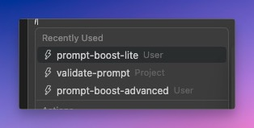
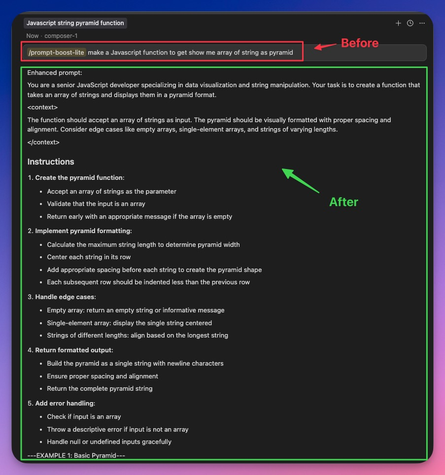
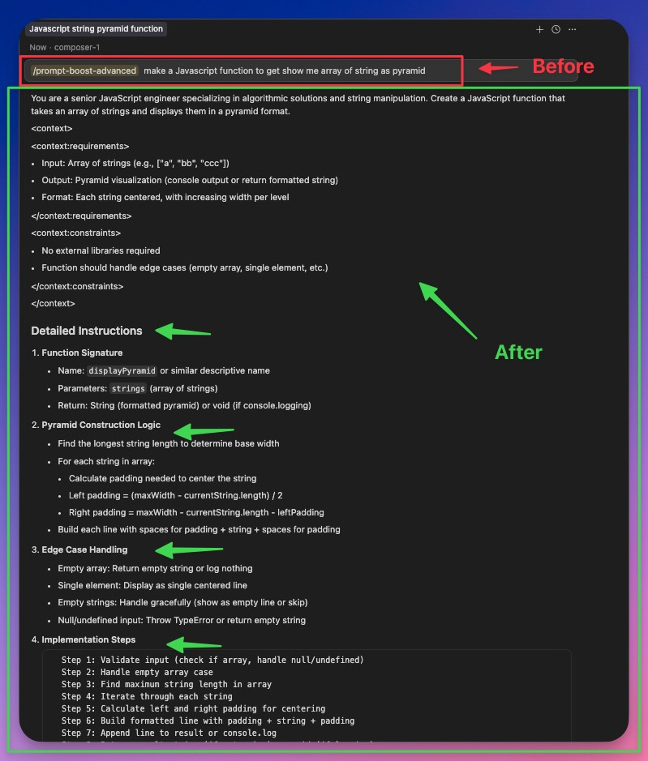
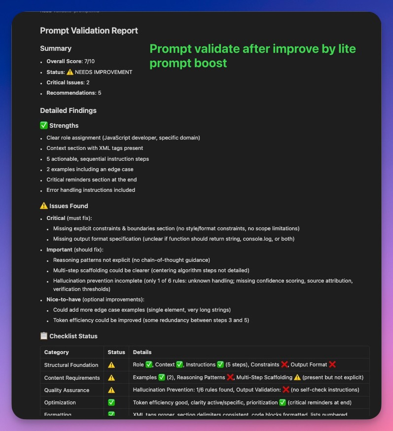
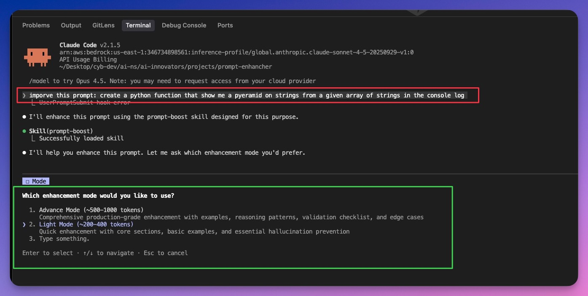
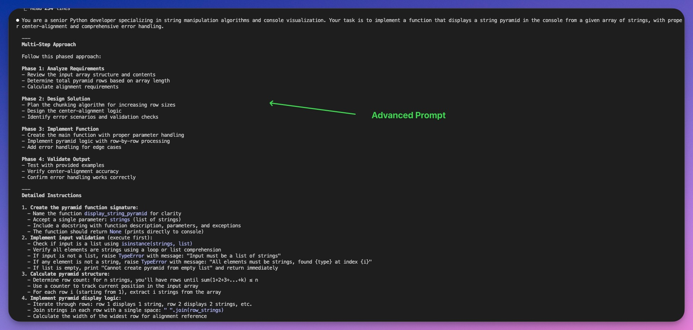
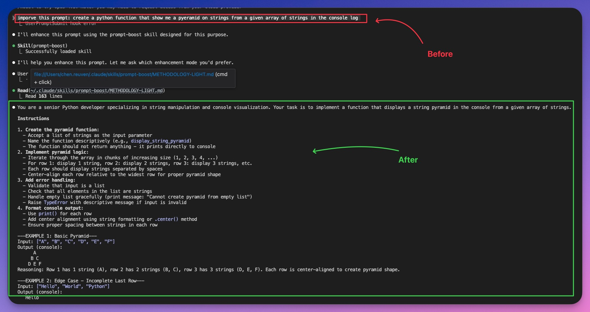
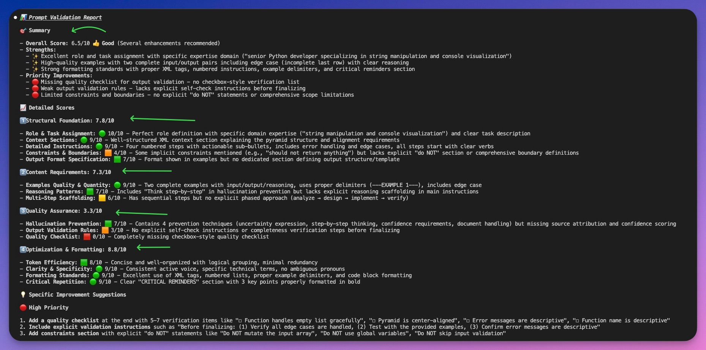

<div align="center">
  
</div>

# Prompt Boost

A multi-platform prompt enhancement tool available as a Cursor slash command and Claude Code skill. Transforms basic prompts into optimized, high-quality prompts using comprehensive prompt engineering methodology.

## Screenshots

### Cursor IDE


*Available prompt-boost slash commands in Cursor IDE*


*Enhancing a basic prompt using advanced mode in Cursor with comprehensive methodology*


*Quick prompt enhancement using lite mode in Cursor for streamlined optimization*


*Validating prompt quality with detailed scoring and improvement suggestions (advanced mode)*


*Validating prompt quality using lite mode validation in Cursor*

### Claude Code


*Selecting enhancement mode (Advance/Light) when using the prompt-boost skill in Claude Code*


*Comprehensive prompt enhancement with advanced methodology in Claude Code*


*Streamlined prompt enhancement using light mode in Claude Code for quick optimization*


*Prompt validation report with scoring, strengths, and prioritized improvement suggestions*

## Features

- **Cursor Slash Command**: Use `/prompt-boost` directly in Cursor IDE
- **Claude Code Skill**: Agent skill for Claude Code with comprehensive methodology

## Installation

1. **Clone and copy:**

   **macOS / Linux:**
   ```bash
   git clone https://github.com/eyalbor/prompt-boost.git
   cd prompt-boost
   cp -r .claude ~/
   cp -r .cursor ~/
   ```

   **Windows (PowerShell):**
   ```powershell
   git clone https://github.com/eyalbor/prompt-boost.git
   cd prompt-boost
   Copy-Item -Recurse .claude ~
   Copy-Item -Recurse .cursor ~
   ```

2. **Restart your tools:**
   - **Cursor IDE**: Restart or reload window (Cmd/Ctrl + Shift + P → "Reload Window")
   - **Claude Code**: Start a new session

That's it!

### What Gets Installed

- ✅ Cursor commands → `~/.cursor/commands/` (2 slash commands)
- ✅ Claude Code skill → `~/.claude/skills/prompt-boost/` (skill docs and methodology)

### Updating

To get the latest version:
```bash
cd prompt-boost
git pull
cp -r .claude ~/
cp -r .cursor ~/
```

## Uninstallation

```bash
bash uninstall.sh
```

This removes:
- Cursor commands from `~/.cursor/commands/`
- Claude Code skill from `~/.claude/skills/prompt-boost/`

## Troubleshooting

### Cursor commands not appearing

1. Restart Cursor IDE or reload the window (Cmd/Ctrl + Shift + P → "Reload Window")
2. Verify files exist: `ls ~/.cursor/commands/prompt-boost-*.md`
3. Check Cursor settings to ensure commands are enabled

### Claude Code skill not loading

1. Restart your Claude Code session
2. Verify files exist: `ls ~/.claude/skills/prompt-boost/`
3. Check file permissions: `chmod -R u+r ~/.claude/skills/prompt-boost/`

### Need Help?

- Check `INSTALL.md` in the downloaded package for detailed instructions
- Report issues: [GitHub Issues](https://github.com/eyalbor/prompt-boost/issues)

## Usage

### Cursor Slash Command

Use the `/prompt-boost` command directly in Cursor's chat or Composer:

1. Type `/prompt-boost` in the chat input
2. Follow it with your basic prompt
3. Cursor will enhance your prompt according to the enhancement rules

Example:
```
/prompt-boost write a function to sort an array
```

## Claude Code Skill

This project includes a Claude Code Agent Skill that enables Claude to enhance prompts using comprehensive prompt engineering methodology.

### Installation

The skill is located in `.claude/skills/prompt-boost/` and includes:
- **SKILL.md**: Main skill definition with quick start guide
- **METHODOLOGY.md**: Comprehensive enhancement framework (Advance mode)
- **METHODOLOGY-LIGHT.md**: Streamlined enhancement framework (Light mode)
- **EXAMPLES.md**: Concrete before/after examples

### Usage in Claude Code

Claude Code automatically loads the skill and applies it when you:
- Ask to "enhance", "improve", or "optimize" a prompt
- Mention "prompt engineering" or "better prompting"
- Request help structuring a complex AI task

**Two enhancement modes available:**

1. **Advance Mode**: Comprehensive enhancement with all features (~500-1000 tokens)
   - Full structural foundation with constraints and boundaries
   - Multiple examples with edge cases
   - Reasoning patterns and validation checklist
   - Token optimization and formatting standards

2. **Light Mode**: Streamlined enhancement for quick optimization (~200-400 tokens)
   - Essential role and task assignment
   - Context sections with XML tags
   - Detailed instructions (3-7 steps)
   - Basic hallucination prevention

## Enhancement Strategy

Prompt Boost transforms basic prompts into optimized prompts following these rules:

1. **Role & Task**: Clear role assignment and high-level task description
2. **Context**: Dynamic content sections with XML tags
3. **Detailed Instructions**: Specific, explicit step-by-step breakdown
4. **Examples**: Concrete examples showing desired output format
5. **Critical Repetition**: Most important instructions repeated at the end
6. **Hallucination Prevention**: Instructions to say "I don't know", think step-by-step, and use quotes for long documents

For complete methodology details, see [`.claude/skills/prompt-boost/METHODOLOGY.md`](.claude/skills/prompt-boost/METHODOLOGY.md).

