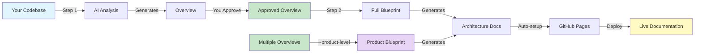

# 🤖 AI-Docs

### Transform Your Codebase into Beautiful Documentation

**Automatically generate comprehensive architecture documentation and stunning GitHub Pages sites using AI**

[Python 3.13+](https://www.python.org/downloads/) [Poetry](https://python-poetry.org/)
[License](LICENSE)

[Quick Start](#-quick-start) • [Features](#-features) • [How It Works](#-how-it-works) • [CI/CD & Bedrock](#cicd-and-aws-bedrock) • [Examples](#-examples) • [Troubleshooting](#-troubleshooting)

---

## 🎯 What is AI-Docs?

AI-Docs is an intelligent CLI tool that analyzes your codebase and automatically generates:

- 📋 **High-level architecture overviews** - Product idea, business flows, and system context
- 🏗️ **Detailed architecture blueprints** - Components, patterns, and design decisions
- 🔄 **Flow documentation** - Step-by-step breakdowns of key business processes
- 🌐 **Beautiful GitHub Pages sites** - Professional documentation with Material theme, hero banners, and card layouts
- 🏢 **Product-level blueprints** - Unified architecture documentation across all microservices in a product
- ⚡ **Easy deployment** - Deploy to GitHub Pages using `mkdocs gh-deploy`

AI-Docs supports **two usage modes**:


| Mode                         | Best For                              | AI Backend                  | Workflow                                                      |
| ---------------------------- | ------------------------------------- | --------------------------- | ------------------------------------------------------------- |
| **Local (Cursor Agent)**     | Developers editing docs interactively | Cursor CLI (`cursor-agent`) | Overview → approve → blueprint, with live streaming           |
| **CI/CD (Claude + Bedrock)** | Pipelines, Jenkins, automated updates | Claude Code + AWS Bedrock   | `ci-update` runs non-interactively; bills to your AWS account |


---


## ✨ Features


|     |
| --- |
|     |


### 🧠 **AI-Powered Analysis**

- Understands your codebase architecture
- Identifies key business flows automatically
- Generates comprehensive documentation
- **Local:** Interactive approval with refinement (Cursor)
- **CI:** Automated diff-focused updates (Claude + Bedrock)


### 🎨 **Beautiful Output**

- Hero banners, card grids, and stat pills
- Dark/light mode toggle
- Mermaid diagrams with colored legends
- Material Design theme


### 🏢 **Product-Level Blueprints**

- Aggregate all microservices in one view
- Cross-service architecture & topology
- End-to-end business flow documentation
- Microservices relationship mapping


### 🚀 **Zero Configuration**

- Works out of the box
- Automatic GitHub Pages setup
- Smart defaults for everything
- No manual configuration needed

---


## 🚀 Quick Start


### Prerequisites


| Requirement                           | Local Mode (Cursor)             | CI Mode (Claude + Bedrock) |
| ------------------------------------- | ------------------------------- | -------------------------- |
| Python 3.13+                          | ✓                               | ✓                          |
| Poetry                                | ✓                               | ✓                          |
| **cursor-agent**                      | ✓ Required                      | Not used                   |
| **Claude Code CLI** + **AWS Bedrock** | Not used                        | ✓ Required                 |
| **mdcat**                             | Optional (nice terminal output) | Not needed                 |


**Common (both modes):** Clone the repo, `poetry install`, and run `ai-docs --help`.

📦 Installing cursor-agent

**macOS, Linux, and Windows (WSL):**

```bash
# Install with a single command
curl https://cursor.com/install -fsS | bash
```

**Verify installation:**

```bash
cursor-agent --version
```

**Add to PATH (if needed):**

For bash:

```bash
echo 'export PATH="$HOME/.local/bin:$PATH"' >> ~/.bashrc
source ~/.bashrc
```

For zsh:

```bash
echo 'export PATH="$HOME/.local/bin:$PATH"' >> ~/.zshrc
source ~/.zshrc
```

**License:**

> ℹ️ If you don't have a license for cursor-agent, please refer to **Roy Ben Yossef** for access.

For more details, see the [official Cursor CLI installation guide](https://cursor.com/docs/cli/installation).

📦 Installing mdcat (optional)

`mdcat` provides beautiful terminal rendering of markdown files with syntax highlighting and formatting.

**macOS:**

```bash
# Using Homebrew
brew install mdcat
```

**Linux:**

```bash
# Using cargo (Rust package manager)
cargo install mdcat

# Or download pre-built binaries from GitHub releases
# https://github.com/swsnr/mdcat/releases
```

**Windows (WSL):**

```bash
# Using cargo
cargo install mdcat
```

**Verify installation:**

```bash
mdcat --version
```

> 💡 **Note:** While mdcat is optional, it significantly improves the readability of generated documentation in your terminal during the approval process.


### Installation

```bash
# Clone the repository
cd ai-docs

# Activate the virtual environment in your current shell
# poetry v1:
poetry shell
# poetry v2:
eval $(poetry env activate)

# Install the dependencies and the project itself:
poetry install

# Verify installation
ai-docs --help
```

---


### Local Mode: Three Simple Steps (with Cursor)

Use this workflow when you're developing locally and want interactive approval, live streaming, and full control over the generated docs.

#### **Step 1️⃣: Generate Overview**

```bash
ai-docs overview --path /path/to/your/repo
```

**What happens:**

- 🔍 AI analyzes your entire codebase
- 📝 Generates a high-level overview with:
  - Product idea and purpose
  - Key business flows
  - System context and users
- 👀 You review and approve (or provide feedback)
- ✅ Creates `ai_docs/approved_overview.md`

📸 See example output

```markdown
### Product Idea
This is a session data management service that provides real-time 
ingestion, storage, and querying of user session events across 
multiple tenants...

### Key Business Flows
1. **Session Event Ingestion** - Processes incoming session events...
2. **Tenant Initialization** - Sets up isolated tenant environments...
3. **Query Aggregation** - Retrieves and aggregates session data...

### Who Invokes the Service
- Producer microservices send session events via REST API
- Admin services manage tenant provisioning
- Analytics services query aggregated data
```

---


#### **Step 2️⃣: Generate Full Documentation**

```bash
ai-docs blueprint --path /path/to/your/repo
```

> 💡 **macOS Note:** Blueprint generation can take a while. On macOS, the tool automatically prevents your system from sleeping during the process, so feel free to grab a coffee! ☕

**What happens:**

- 🏗️ Generates comprehensive architecture blueprint
- 📄 Creates detailed flow documentation
- 🌐 **Automatically sets up GitHub Pages:**
  - ✓ Generates `mkdocs.yml` configuration
  - ✓ Creates beautiful homepage
  - ✓ Sets up media assets (logo, favicon)
  - ✓ Adds custom styling

📦 See generated structure

```
your-repo/
├── ai_docs/                                    # 📁 All documentation
│   ├── approved_overview.md                    # ✓ Approved overview
│   ├── index.md                                # 🏠 Homepage
│   ├── YourProject_Architecture_Blueprint.md   # 📘 Full blueprint
│   ├── flows/                                  # 🔄 Business flows
│   │   ├── session-ingestion-flow.md
│   │   ├── tenant-initialization-flow.md
│   │   └── query-aggregation-flow.md
│   ├── media/                                  # 🎨 Assets
│   │   ├── favicon.ico
│   │   └── logo.svg
│   └── stylesheets/                            # 💅 Styling
│       └── extra.css
│
└── mkdocs.yml                                  # ⚙️ MkDocs config
```

---


#### **Step 3️⃣: Preview & Deploy**

```bash
# Preview locally
cd /path/to/your/repo
mkdocs serve
# 🌐 Open http://localhost:8000
```

> 💡 **Note:** Make sure you have MkDocs and its dependencies installed. You can install them with:
>
> ```bash
> pip install mkdocs mkdocs-material pymdown-extensions mkdocs-git-revision-date-plugin
> ```

**Deploy to GitHub Pages:**

```bash
# Deploy to GitHub Pages
mkdocs gh-deploy
```

**Enable GitHub Pages:**

1. Go to Repository Settings → Pages
2. Set source to `gh-pages` branch
3. Save and wait ~1 minute
4. Visit `https://<username>.github.io/<repo-name>/`

---


### CI Mode: Automated Updates (Claude Code + AWS Bedrock)

Use this workflow for **pipelines** (e.g. Jenkins, GitHub Actions). Docs are generated non-interactively using Claude Code backed by **AWS Bedrock**, so usage is billed to your team's AWS account instead of personal Cursor budgets.

#### Prerequisites: Filesystem Access Required

**Important:** ai-docs needs **filesystem access** to the target repository to analyze code and generate documentation.


| Mode      | How Repository Access Works                                              |
| --------- | ------------------------------------------------------------------------ |
| **Local** | You provide `--path /path/to/repo` pointing to a local clone             |
| **CI**    | Pipeline must clone the target repo first, then run ai-docs on that path |


**One-time human setup:** A developer runs `ai-docs overview` and `ai-docs blueprint` once locally (with Cursor), approves the overview, and pushes `ai_docs/` (including `approved_overview.md`) to the main branch of **the target repository**.

**CI flow:** On each pipeline run:

1. **Clone the target repository** (the repo you want to document)
2. **Run** `ai-docs ci-update` on that cloned repo path:
  - Computes the diff since the last doc generation (using `ai_docs/.last_doc_hash`)
  - Runs the blueprint in **diff-focused** mode (or full mode if no prior hash exists)
  - Uses **Claude Code + Bedrock**—no Cursor license needed on the runner
3. **Commit changes** to the target repo using a GitHub service user
4. **Create a PR** with the updated documentation

**Quick start for CI:**

```bash
# In your Jenkinsfile or pipeline:

# 1. Clone the target repository (the one to document)
git clone https://github.com/your-org/your-repo.git
cd your-repo

# 2. Set up environment
export CLAUDE_CODE_USE_BEDROCK=1
export AWS_REGION=us-east-1
# Ensure AWS credentials are available (IAM role or env vars)

# 3. Install ai-docs (if not pre-installed on runner)
# Option A: Clone ai-docs repo and install
cd /tmp/ai-docs
poetry install --no-interaction

# Option B: Install from package (if published internally)
# pip install ai-docs

# 4. Run ai-docs on the target repo
npm install -g @anthropic-ai/claude-code
poetry run ai-docs ci-update --path /path/to/your-repo --runner claude-code

# 5. Commit and create PR (using GitHub service user)
cd /path/to/your-repo
git config user.name "docs-bot"
git config user.email "docs-bot@your-org.com"
git checkout -b "docs-update-${BUILD_NUMBER}"
git add ai_docs/ mkdocs.yml
git commit -m "chore: update AI docs from CI"
git push -u origin "docs-update-${BUILD_NUMBER}"
gh pr create --title "chore: update AI docs" --body "Automated docs update"
```

See [CI/CD and AWS Bedrock](#cicd-and-aws-bedrock) for full Bedrock setup, IAM permissions, and a complete Jenkinsfile template.

---


## 🎨 What You Get


### Beautiful Documentation Site


|     |
| --- |
|     |


**🏠 Homepage**

- Hero banner with product tagline
- Feature cards with hover effects
- Flow links with colored badges
- Dark/light mode support

**📘 Architecture Blueprint**

- System architecture
- Component diagrams
- Design patterns
- Technology stack

**🔄 Flow Documentation**

- Step-by-step flows
- Mermaid diagrams
- Code examples
- Best practices

**🎨 Material Theme**

- Dark/light mode
- Mobile responsive
- Search functionality
- Syntax highlighting

---


## 🔧 How It Works


### Local Mode (Cursor)




### CI Mode (Claude + Bedrock)

```mermaid
graph LR
    A[Pipeline Trigger] -->|Clone| B[Target Repo]
    B -->|Install| C[ai-docs Tool]
    C -->|Run ci-update| D[Diff Analysis]
    D -->|Uses| E[approved_overview.md]
    E -->|Generate| F[Updated Docs]
    F -->|Commit| G[Create PR]
    G -->|Merge| H[Live Documentation]
    
    style A fill:#e1f5ff
    style E fill:#c8e6c9
    style H fill:#fff9c4
```




**Key difference:** CI mode requires the target repository to be cloned first, then ai-docs runs on that cloned path.

### Workflows


#### Local Mode (Cursor): First-Time Documentation


| Step             | Command             | What Happens                                                    | Output                                     |
| ---------------- | ------------------- | --------------------------------------------------------------- | ------------------------------------------ |
| **1. Overview**  | `ai-docs overview`  | AI analyzes codebase; you review and approve                    | `ai_docs/approved_overview.md`             |
| **2. Blueprint** | `ai-docs blueprint` | Generates detailed architecture docs based on approved overview | Blueprint + flow docs + GitHub Pages setup |


#### Local Mode: Updating Existing Documentation


| Step       | Command             | What Happens                                      | Output                                       |
| ---------- | ------------------- | ------------------------------------------------- | -------------------------------------------- |
| **Update** | `ai-docs blueprint` | Regenerates docs using existing approved overview | Updated blueprint + flow docs + GitHub Pages |


> **Note:** If `ai_docs/approved_overview.md` already exists, you can skip the overview step and run `ai-docs blueprint` directly.


#### CI Mode (Claude + Bedrock): Automated Updates


| Step          | Command                                  | What Happens                                                              | Output                                     |
| ------------- | ---------------------------------------- | ------------------------------------------------------------------------- | ------------------------------------------ |
| **ci-update** | `ai-docs ci-update --runner claude-code` | Computes diff since last run; runs blueprint in diff-focused or full mode | Updated docs; pipeline commits or opens PR |


#### 🏢 Product-Level Blueprint (Multi-Microservice)


| Step             | Command                                                                | What Happens                                                              | Output                                                                      |
| ---------------- | ---------------------------------------------------------------------- | ------------------------------------------------------------------------- | --------------------------------------------------------------------------- |
| **Prerequisite** | Run `ai-docs overview` + `ai-docs blueprint` on each microservice repo | Each service has its own `ai_docs/approved_overview.md`                   | Per-service documentation                                                   |
| **Aggregate**    | Collect all `ai_docs_<service>` directories into a single product repo | A central repository contains all microservice docs                       | e.g. `sm-docs/ai_docs_session_data/`, `sm-docs/ai_docs_events_broker/`, ... |
| **Generate**     | `ai-docs blueprint --path /path/to/product-repo --product-level`       | Synthesizes all microservice overviews into unified product documentation | Product architecture + relationships + flows + GitHub Pages                 |


> **Note**: The product-level blueprint uses Claude 4.6 Opus by default (configurable via `product_llm` in `config.json`). Generation may take up to 15 minutes.

---


## 📚 Commands Reference


### Core Commands


| Command                           | Mode   | Description                                                      |
| --------------------------------- | ------ | ---------------------------------------------------------------- |
| `ai-docs overview --path <repo>`  | Local  | Generate overview; interactive approval → `approved_overview.md` |
| `ai-docs blueprint --path <repo>` | Local  | Full blueprint + flows + GitHub Pages (uses Cursor by default)   |
| `ai-docs ci-update --path <repo>` | **CI** | Auto-update from diff; uses Claude Code + Bedrock by default     |
| `ai-docs mkdocs --path <repo>`    | Both   | Refresh GitHub Pages setup only (no regeneration)                |


> **Important:** `<repo>` must be an **absolute path** to a local clone of the repository you want to document. For CI, this is the path where you cloned the target repo in your pipeline.


### Runner and Options

```bash
# Use Claude Code + Bedrock (for CI or headless runs)
ai-docs blueprint --path /path/to/repo --runner claude-code

# Skip GitHub Pages generation
ai-docs blueprint --path /path/to/repo --skip-github-pages

# Focus updates on changed code only (incremental)
ai-docs blueprint --path /path/to/repo --diff-file /path/to/changes.diff

# Generate product-level blueprint across all microservices
ai-docs blueprint --path /path/to/product-repo --product-level
```


#### `--product-level` Option

The `--product-level` option generates a unified architecture blueprint that spans all microservices in a product. It is designed for a **product documentation repository** that contains `ai_docs_<service_name>/` directories (one per microservice), each with an `approved_overview.md`.

**What it generates:**


| Document                            | Description                                                                  |
| ----------------------------------- | ---------------------------------------------------------------------------- |
| `index.md`                          | Elegant landing page with hero banner, capability cards, and flow links      |
| `Product_Architecture_Blueprint.md` | Full architecture: topology, communication patterns, data architecture, ADRs |
| `Microservices_Relationships.md`    | Visual guide: communication matrix, data ownership, collaboration patterns   |
| `flows/*.md`                        | One file per end-to-end business flow spanning multiple services             |


**Usage:**

```bash
ai-docs blueprint --path /path/to/product-repo --product-level
```

📦 See expected repository structure

```
product-repo/                          # e.g. sm-docs
├── ai_docs_session_data/              # Microservice 1
│   └── approved_overview.md
├── ai_docs_events_broker/             # Microservice 2
│   └── approved_overview.md
├── ai_docs_behavior_manager/          # Microservice 3
│   └── approved_overview.md
├── ...                                # More microservices
│
├── sm_docs/                           # ← Generated product docs
│   ├── index.md                       # 🏠 Elegant homepage
│   ├── Product_Architecture_Blueprint.md  # 📘 Full blueprint
│   ├── Microservices_Relationships.md     # 🔗 Relationships visual guide
│   ├── flows/                         # 🔄 End-to-end flows
│   │   ├── session-ingestion-flow.md
│   │   ├── risky-activity-detection-flow.md
│   │   └── tenant-lifecycle-flow.md
│   ├── media/                         # 🎨 Assets
│   │   ├── favicon.ico
│   │   └── logo.svg
│   └── stylesheets/                   # 💅 Rich theme CSS
│       └── extra.css
│
└── mkdocs.yml                         # ⚙️ MkDocs config
```

> **Note**: `--product-level` cannot be combined with `--diff-file`. The product docs directory name is derived from the repository name (e.g. `sm-docs` → `sm_docs`).


#### `--diff-file` Option

The `--diff-file` option allows you to focus blueprint updates on specific code changes rather than regenerating the entire documentation. This is useful for:

- **Incremental updates** - Update only the parts affected by recent changes
- **Faster regeneration** - Skip unchanged sections for quicker updates
- **Delta summaries** - Generate focused documentation on what changed

**Usage:**

```bash
# Generate a diff file from git
git diff main...HEAD > changes.diff

# Update blueprint focusing on the changes
ai-docs blueprint --path /path/to/repo --diff-file changes.diff
```


### CI/CD and AWS Bedrock

The **claude-code** runner uses **AWS Bedrock** to invoke Claude models. This is ideal for CI pipelines:

- **No Cursor license** on the runner
- **Billed to your AWS account** (pay-per-use)
- **Non-interactive**—no approval prompts
- **Diff-focused updates**—`ci-update` only regenerates docs for changed code when possible


#### Installing Claude Code CLI

Claude Code is an npm package requiring **Node.js 18+**:

```bash
# On your local machine or Jenkins runner
npm install -g @anthropic-ai/claude-code

# Verify installation
claude --version
```


#### AWS Bedrock Setup (one-time per AWS account)

> **Important:** Each AWS account must complete these steps before any Anthropic model can be invoked on Bedrock. Without this, all calls will fail with `ResourceNotFoundException: Model use case details have not been submitted`.

1. **Submit Anthropic use case form (required, one-time):**
  - Go to [Amazon Bedrock console](https://console.aws.amazon.com/bedrock/) in **us-east-1**
  - Click **Chat/Text playground** in the left sidebar
  - Select any Anthropic Claude model (e.g. Claude Opus 4.6)
  - You will be prompted to fill out a **use case details form** -- complete and submit it
  - **Wait ~15 minutes** after submission for access to activate
  - This only needs to be done once per AWS account
2. **Enable model access (cross-region inference profile):**
  - Go to [Amazon Bedrock console](https://console.aws.amazon.com/bedrock/) → **Model access**
  - Find Claude Opus 4.6 → choose **US Anthropic** (cross-region, US) and enable it
  - This creates inference profile `us.anthropic.claude-opus-4-6-v1`
  - Wait for the status to show as **Available**
3. **Activate AWS Marketplace subscription (required for Claude Opus 4.6):**
  > **Important:** Claude Opus 4.6 is served via AWS Marketplace. An admin with `aws-marketplace:Subscribe` permissions must invoke the model once to enable it account-wide for all users.
  >  **Ask someone with AWS admin/Marketplace permissions to run this command once:**
  >  Once an admin successfully invokes the model, it becomes available for everyone in the AWS account. This only needs to be done **once per AWS account**.
4. **Verify model access** (run from a machine with AWS credentials):
  ```bash
   # List available Claude inference profiles
   aws bedrock list-inference-profiles --region us-east-1 | grep anthropic

   # Test direct invocation
   echo '{"anthropic_version":"bedrock-2023-05-31","max_tokens":100,"messages":[{"role":"user","content":"Hello"}]}' > /tmp/req.json
   aws bedrock-runtime invoke-model \
     --region us-east-1 \
     --model-id us.anthropic.claude-opus-4-6-v1 \
     --cli-binary-format raw-in-base64-out \
     --body file:///tmp/req.json \
     /tmp/out.json && cat /tmp/out.json
  ```
5. **Configure AWS credentials** (one of these methods):
  ```bash
   # Option A: AWS CLI
   aws configure

   # Option B: Environment variables
   export AWS_ACCESS_KEY_ID=your-access-key
   export AWS_SECRET_ACCESS_KEY=your-secret-key

   # Option C: AWSSSO profile
   awssso
   export AWS_PROFILE=your-profile
  ```
6. **Required IAM permissions:**
  ```json
   {
     "Version": "2012-10-17",
     "Statement": [{
       "Effect": "Allow",
       "Action": [
         "bedrock:InvokeModel",
         "bedrock:InvokeModelWithResponseStream",
         "bedrock:ListInferenceProfiles"
       ],
       "Resource": [
         "arn:aws:bedrock:*:*:inference-profile/*",
         "arn:aws:bedrock:*:*:foundation-model/*"
       ]
     }]
   }
  ```


#### Cost Information

**AWS Marketplace Activation:** The one-time activation command (step 3 above) costs less than $0.01 - it's a minimal test invocation with 10 output tokens.

**Ongoing Usage (Pay-Per-Use):** Once activated, you only pay for actual API usage. There are no subscription fees, licenses, or minimums.

**Claude Opus 4.6 Pricing (Bedrock, as of Feb 2026):**

- Input tokens: $15 per million tokens (~$0.015 per 1,000 tokens)
- Output tokens: $75 per million tokens (~$0.075 per 1,000 tokens)

**Example costs:**

- Full architecture blueprint generation (100K input, 50K output): ~$5.25
- Small documentation update (10K input, 5K output): ~$0.53
- CI/CD diff-based update (5K input, 2K output): ~$0.23

**Cost Comparison:**


| Method          | Cost Model                      | Best For               |
| --------------- | ------------------------------- | ---------------------- |
| **Cursor Pro**  | $20/user/month subscription     | Individual developers  |
| **AWS Bedrock** | Pay-per-use (~$5/blueprint run) | CI/CD, team automation |


**Why use Bedrock for CI/CD?**

- No monthly per-user fees - only pay when docs are generated
- Billed to team AWS account instead of individual developer budgets
- Scales with actual usage (infrequent updates = minimal cost)
- Developers keep their Cursor Pro budget for interactive development

**Cost optimization tips:**

1. **Run CI/CD selectively** (e.g., only on main branch or release tags)
2. **Consider Claude Sonnet 4.6** for smaller updates (~5x cheaper than Opus)
3. **Monitor usage** with AWS Cost Explorer filtered by Bedrock service


#### Jenkins Integration

The `Jenkinsfile.ai-docs` template in this repo provides a complete example for documenting a **separate repository** (not the ai-docs repo itself). The pipeline:

1. **Clones the target repository** (the repo you want to document)
2. **Clones the ai-docs tool** and installs dependencies
3. **Runs** `ai-docs ci-update` pointing to the target repo path
4. **Creates a PR** with updated documentation using a GitHub service user

**Key setup requirements:**

- Configure `TARGET_REPO` environment variable with your repository URL
- Set up Jenkins credentials for a GitHub service user (for cloning and creating PRs)
- Ensure the runner has AWS credentials for Bedrock access
- The target repo must have `ai_docs/approved_overview.md` (created once by a human)


#### Environment Variables for Jenkins Runner


| Variable                  | Required    | Description                                                               |
| ------------------------- | ----------- | ------------------------------------------------------------------------- |
| `CLAUDE_CODE_USE_BEDROCK` | Yes         | Set to `1` to use AWS Bedrock                                             |
| `AWS_REGION`              | Yes         | e.g. `us-east-1`                                                          |
| AWS credentials           | Yes         | IAM role for the runner, or `AWS_ACCESS_KEY_ID` / `AWS_SECRET_ACCESS_KEY` |
| `TARGET_REPO`             | Recommended | URL of the repository to document (see Jenkinsfile example)               |
| GitHub credentials        | Yes         | Service user credentials for cloning repos and creating PRs               |


### Configuration (`config.json`)

The `config.json` file in the ai-docs project root controls runner configurations, LLM models, and blueprint settings:

```json
{
    "runners": {
        "cursor": {
            "command": "cursor-agent",
            "model_flag": "--model",
            "model": "opus-4.6"
        },
        "claude-code": {
            "command": "claude",
            "model_flag": "--model",
            "model": "us.anthropic.claude-opus-4-6-v1",
            "allowed_tools": ["Read", "Edit", "Write", "Bash"]
        }
    },
    "product_llm": "claude-4.6-opus",
    "blueprint_config": {
        "project_type": "Auto-detect",
        "architecture_pattern": "Auto-detect",
        "diagram_type": "C4",
        "diagram_syntax": "MERMAID",
        "detail_level": "Comprehensive"
    }
}
```


| Key                | Description                                                                | Default           |
| ------------------ | -------------------------------------------------------------------------- | ----------------- |
| `runners`          | Runner configurations (cursor, claude-code) with command, model, and flags | —                 |
| `product_llm`      | LLM model for product-level blueprint                                      | `claude-4.6-opus` |
| `blueprint_config` | Blueprint generation settings (auto-detected when possible)                | —                 |


### Custom Instructions

Custom instructions are loaded from your target repository and injected into all prompts (overview, blueprint, and product-level). Two mechanisms are supported:

#### 1. Global instructions (`.ai-docs-instructions.md`)

Optional context that applies to all documentation. **Search order** (first match wins):

1. `<target>/ai_docs/.ai-docs-instructions.md`
2. `<target>/.ai-docs-instructions.md`
3. `<repo>/.ai-docs-instructions.md` (only when `--target` differs from `--path`)

**Example** `.ai-docs-instructions.md`:

```markdown
## Additional Context

- This service is part of the "Vault" product family.
- Use "Secrets Manager" (not "SM") as the product name throughout.
- Ignore the `legacy/` directory — it is deprecated.
```


#### 2. Specialized document prompts (`.ai-docs-instructions/`)

For **extensible, modular** specialized documents (e.g. policy keys, config keys, API reference), use a directory of prompt files:

- **Location:** `<target>/.ai-docs-instructions/` or `<target>/ai_docs/.ai-docs-instructions/`
- **Format:** One `.md` file per document type. Each file can have optional YAML frontmatter:

```yaml
---
output: ai_docs/CloudPolicyKeys.md   # path relative to target (required if non-standard)
description: Policy keys reference   # optional
---
```

If `output` is omitted, it defaults to `ai_docs/<filename>.md`. The body is the full prompt/specification for that document.

**Example structure:**

```
cloud-doc/
├── .ai-docs-instructions.md          # global context (optional)
└── .ai-docs-instructions/
    ├── README.md                     # ignored (documentation only)
    ├── CloudPolicyKeys.md            # → ai_docs/CloudPolicyKeys.md
    ├── ConfigKeys.md                 # → ai_docs/ConfigKeys.md
    └── ApiEndpoints.md               # → ai_docs/ApiEndpoints.md
```

To add a new specialized document, create a new `.md` file in `.ai-docs-instructions/` with the full prompt. Run `ai-docs blueprint` — the document will be generated. No code changes required.

### Preview & Deploy

```bash
# Preview locally
cd /path/to/repo
mkdocs serve

# Manual deployment
mkdocs gh-deploy

# Build only (no deploy)
mkdocs build
```

---


## 🎯 Examples


### Example 1: New Project Documentation

```bash
# Start from scratch
ai-docs overview --path ~/projects/my-api

# Review and approve the overview
# ✓ Approved overview written to: ~/projects/my-api/ai_docs/approved_overview.md

# Generate full documentation
ai-docs blueprint --path ~/projects/my-api

# Preview and deploy
cd ~/projects/my-api
mkdocs serve
mkdocs gh-deploy
```


### Example 2: Update Existing Documentation

```bash
# Regenerate after code changes
ai-docs blueprint --path ~/projects/my-api

# The tool will:
# ✓ Update architecture analysis
# ✓ Regenerate flow documents
# ✓ Maintain your customizations
# ✓ Preserve mkdocs.yml settings
```


### Example 3: Incremental Update with Diff File

```bash
# Generate a diff of your recent changes
cd ~/projects/my-api
git diff main...HEAD > changes.diff

# Update documentation focusing only on the changes
ai-docs blueprint --path ~/projects/my-api --diff-file changes.diff

# The tool will:
# ✓ Focus on code affected by the diff
# ✓ Generate a delta summary of changes
# ✓ Update only relevant sections
```


### Example 4: Product-Level Blueprint

```bash
# Prerequisites: each microservice already has ai_docs/approved_overview.md
# Collect them into one product repo with ai_docs_<service>/ directories

# Generate unified product documentation
ai-docs blueprint --path ~/projects/sm-docs --product-level

# Preview the product documentation
cd ~/projects/sm-docs
mkdocs serve

# The tool will:
# ✓ Discover all ai_docs_* directories
# ✓ Read each microservice's approved_overview.md
# ✓ Synthesize product-level architecture, relationships, and flows
# ✓ Generate an elegant homepage with hero banner and card layout
# ✓ Set up GitHub Pages with the rich Material theme
```


### Example 5: Custom Workflow

```bash
# Generate docs without GitHub Pages
ai-docs blueprint --path ~/projects/my-api --skip-github-pages

# Later, add GitHub Pages separately
ai-docs mkdocs --path ~/projects/my-api
```


### Example 6: Live Examples

See AI-Docs in action with documentation sites generated for your own services, for example:

- [Accounts Manager](https://pages.<GITHUB_HOST>/<ORG>/accounts-manager/) - Architecture documentation for an accounts management service
- [Session Data Service](https://pages.<GITHUB_HOST>/<ORG>/session-data-service/) - Comprehensive documentation for a session data management service
- [Events Broker](https://pages.<GITHUB_HOST>/<ORG>/events-broker/) - Architecture documentation for an events broker service
- [Secrets Management Service](https://pages.<GITHUB_HOST>/<ORG>/secrets-mgmt-service/) - Architecture documentation for a secrets management service
- [Provisioning Service](https://pages.<GITHUB_HOST>/<ORG>/provisioning-service/) - Architecture documentation for a provisioning service
- [Proxy Service](https://pages.<GITHUB_HOST>/<ORG>/proxy-service/) - Architecture documentation for a proxy service
- [Policies Service](https://pages.<GITHUB_HOST>/<ORG>/policies-service/) - Architecture documentation for a policies service

---


## 🔄 Updating Documentation


### When Your Code Changes

**Local:** Re-run the blueprint command:

```bash
ai-docs blueprint --path /path/to/your/repo
```

**CI:** If you use `ci-update` in a pipeline, it will run automatically on each build and update docs based on the diff since the last run.

The tool will:

- ✓ Analyze the updated codebase
- ✓ Regenerate architecture documentation
- ✓ Update flow documents
- ✓ Preserve your customizations in `mkdocs.yml`
- ✓ Maintain custom styles and assets


### Updating Documentation

After making changes to your documentation:

1. Modify files in `ai_docs/` or update `mkdocs.yml`
2. Deploy the changes: `mkdocs gh-deploy`

This will rebuild and deploy your documentation to GitHub Pages! 🚀

---


## 🐛 Troubleshooting


### "No module named 'typer'"

You're running `ai-docs` with the wrong Python environment.

**Fix:**

```bash
cd /path/to/ai-docs
poetry install
ai-docs overview --path /path/to/repo
```


### "approved_overview.md not found"

You need to run the overview step first:

```bash
ai-docs overview --path /path/to/repo
```


### GitHub Pages Not Deploying

1. **Run** `mkdocs gh-deploy` to deploy your documentation
2. **Enable GitHub Pages** in Settings → Pages
3. **Set source** to `gh-pages` branch
4. **Wait ~1 minute** for deployment


### Diagrams Not Rendering

1. Check Mermaid syntax in your source files
2. Test locally: `mkdocs serve`
3. Ensure `pymdownx.superfences` is in `mkdocs.yml`


### Wrong Environment

Check which `ai-docs` you're running:

```bash
which ai-docs
# Should point to: /path/to/ai-docs/.venv/bin/ai-docs
```

If not, ensure ai-docs is in your PATH or use the full path:

```bash
/path/to/ai-docs/.venv/bin/ai-docs overview --path /path/to/repo
```


### CI Mode: ResourceNotFoundException or "use case details not submitted"

AWS Bedrock requires a one-time setup before Claude models work:

1. **Submit the Anthropic use case form** in the Bedrock console (Chat/Text playground → select any Claude model → fill and submit)
2. **Wait ~15 minutes** for access to activate
3. **Activate the AWS Marketplace subscription**—an admin must invoke the model once (see [AWS Bedrock Setup](#aws-bedrock-setup-one-time-per-aws-account))


### CI Mode: approved_overview.md not found

`ci-update` requires `ai_docs/approved_overview.md` to exist **in the target repository**. 

**Fix:**

1. A developer must run `ai-docs overview` and `ai-docs blueprint` once locally (with Cursor) on the target repository
2. Approve the overview
3. Push the generated `ai_docs/` directory to the target repo's main branch
4. Then CI can run on subsequent builds


### CI Mode: Path or filesystem access issues

**Error:** `FileNotFoundError` or "No such file or directory"

**Cause:** ai-docs needs filesystem access to analyze code. The pipeline must clone the target repository first.

**Fix:**

1. Ensure your pipeline clones the target repository before running ai-docs
2. Use the correct path: `--path /workspace/target-repo` (absolute path to the cloned repo)
3. Verify the clone succeeded: `ls -la /workspace/target-repo` should show the repo contents

---


## 💡 Best Practices


### ✅ Do's

- ✓ **Version control** - Commit `ai_docs/` and `mkdocs.yml` to your target repo (ignore `site/`)
- ✓ **Regular updates** - Re-run blueprint when architecture changes (local or CI)
- ✓ **Preview first** - Always test with `mkdocs serve` before deploying
- ✓ **Custom content** - Add extra pages in `ai_docs/` and update nav
- ✓ **Review AI output** - Verify generated content before approval
- ✓ **CI setup** - Ensure target repo has `approved_overview.md` before running CI
- ✓ **Service user** - Use a dedicated GitHub service account for CI commits/PRs


### ❌ Don'ts

- ✗ Don't commit `site/` directory (add to `.gitignore`)
- ✗ Don't manually edit generated files without re-running the tool
- ✗ Don't skip the overview approval step
- ✗ Don't add MkDocs deps to ai-docs tool itself (they go in target repo)

---


## 📖 Additional Resources

- 📘 [MkDocs Documentation](https://www.mkdocs.org/)
- 🎨 [Material for MkDocs](https://squidfunk.github.io/mkdocs-material/)
- 🔧 [GitHub Pages Guide](https://docs.github.com/en/pages)
- 🤖 [Cursor Agent](https://cursor.sh/)

---


## 📝 License

MIT License - feel free to use this tool for your projects!

---

⭐ Star this repo if you find it useful!

[Report Bug](https://github.com/yourusername/ai-docs/issues) • [Request Feature](https://github.com/yourusername/ai-docs/issues)